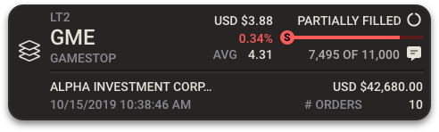

# FTI Component: FTIBlockCard

## Design

Exported @2x size:



For more, see the component in Storybook.

## Description

The FTIBlockCard is designed to display a single order in the kanban view.

The component is used in the following cases:

- Block Orders Card

## Data Model

### New Orders Card

The following data model was copied into this documentation as of 2019-11-27.  To see real-time model here: fti-sdk/lib/datasources/fti/orders/model/index.js

```  BASE: ds.constants.SRC.value,
  BASE: ds.constants.SRC.value,
  avg: 'aveExecPrice',
  buy: 'bs',
  company_name1: 'issue1',
  company_name2: 'issue2',
  currency_code: 'currcode',
  fix_stat: 'fixStat',
  id: 'seq',
  nbr_of_orders: 'ordercount',
  order_date: 'orderdate',
  placed: 'totalExec', // totalExecuted
  progress: 'balance', // should be a % for the progress bar
  progress_orig: 'OrigUnits',
  symbol: 'reuters',
  symbol_price: 'currprc',
  total_amt: 'usdbalance',
  trader_id: 'pby',
```
