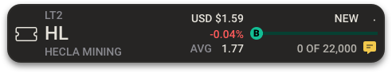

# FTI Component: FTIMiniCard

## Design

Exported @2x size:



For more, see the component in Storybook.

## Description

The FTIMiniCard is designed to display a single order in the kanban view.

The component is used in the following cases:

- New Orders Card

## Data Model

### New Orders Card

The following data model was copied into this documentation as of 2019-11-27.  To see real-time model here: fti-sdk/lib/datasources/fti/orders_new/model/index.js

```id: 'txser',
  trader_id: 'pby',
  currency_code: 'isscurr',
  symbol_price1: 'currprice',
  symbol_price2: 'usValue',
  buy: 'bs',
  status_fix: 'tstatus',
  symbol: 'reuters',
  percentage_change: '*pctChg',
  company_name1: 'issue1',
  avg: 'averagePrice',
  units: '',
  total_units: 'units',
  ```
