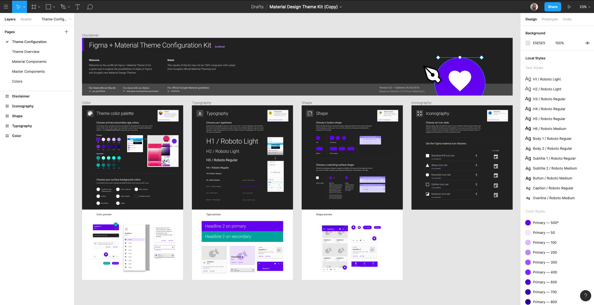

# Project Thor Design Documentation

## Links to Documentation

This readme.md is related to *design* documentation only.  For documentation on the broader design system and application architecture, see the readme in the root directory of each repository:

- thor/[readme.md](readme.md) (the root directory readme in this repository)
- fti-blotter/readme.md
- fti-sdk/readme.md
- fti-design-api/readme.md
- fti-stubs/readme.md

For the FTI project, see [Important Links](http://confluence.corp.frk.com:8090/display/EB/Important+Links) for links to important documentation in Confluence, including User Research.  

---

## Introduction

Project Thor is Cross.Team's nickname for the next version of Franklin Templeton's (FTI) Equity Trading Blotter's frontend.  This project is one part of FTI's larger Equity Trading Modernization Project (ETM).

The goals of the project are to:

- increase the efficiency and effectiveness of users of the blotter by updating the user experience (UX) and user interface (UI)
- maximize performance of the blotter's frontend
- minimize design and development maintenance of the blotter once deployed.  

To meet these goals, the project will be delivered as a design system that will:

- utilize a design language to systematize the design process
- align the design and development process.  i.e. designs are componetized just like components in code.
- implement a design token api that will serve as a single source of truth for typography and color across the application.  
- separate concerns by implementing an sdk to consume endpoints in a performant manner and allow (although we do not suggest) data validation in the front end.

---

## How to Use This Documentation

### Markdown

This documentation is written in [markdown syntax](https://guides.github.com/features/mastering-markdown/) and saved as a markdown (.md) document.  Markdown is lightweight, easy to read, and widely used.    For quick syntax reference, see this [cheatsheet](https://github.com/adam-p/markdown-here/wiki/Markdown-Cheatsheet#links).

There are many tools to create and edit markdown documents.  This documentation was written in [Atom](https://atom.io/), a free, open source text editor.  (Atom even has integrated spell check!)

Markdown syntax is designed lightweight enough to be read directly, but you can also preview the rendered document in many text editors.  In Atom, to toggle the preview panel: `Menu -> Packages -> Markdown Preview -> Toggle Preview`.

It's worth mentioning why we're writing documentation in markdown and not an 'easier' or 'more user friendly' third party tool.  There are tools that create pretty, cleanly organized documentation that also automate some of the process.  We are concerned that in the future those tools may become more expensive, be bought out by a larger company that will change the tools or limit access, or cease all together.  Markdown lets us be documentation agnostic.  Should we later choose to use a third party tool, we can still do so by pushing this documentation to it, without relying on it as the source of truth.  

### Gittin' that Documentation

You're probably familiar with [git](https://git-scm.com/), the free and open source distributed version control system.  Since git works so well for pushing code, why not use it to push documentation?  

Documentation (.md) will be saved to the project repository and updated through git.  Just like code, multiple users will be able to edit documents and track version history.  The repository will serve as a 'source of truth' for all documentation, which can be viewed directly or pushed to other applications.  

Documentation should be scaffolded in the same way the code is.  Like this document, there will be high level documents discussing the product at a high level as well as separate documents discussing specific parts of the code.  For example, each component will have its own corresponding document (.md) with related documentation.  

---

## Design System Concepts

### What is a design system?

> A design system is a collection of reusable components, guided by clear standards, that can be assembled together to build any number of applications. - [Invision](https://www.invisionapp.com/inside-design/guide-to-design-systems/)

### Resources

- [A comprehensive guide to design systems](https://www.invisionapp.com/inside-design/guide-to-design-systems/)
- [DesignSystems.com](https://www.designsystems.com/) - A Figma publication for design systems creators, designers, developers, and managers.  This is a great resources since Figma was used to build the design system on the designer side of the equation.
- [Design Systems Handbook](https://www.designbetter.co/design-systems-handbook)
- [Design Systems Gallery](https://designsystemsrepo.com/design-systems/)
- [Design Systems](https://designsystemsbook.com/) by Alla Kholmatova

### Why use a design system?

As design tools mature, the gap between design and development is narrowing.  No longer should designers gather requirements, test with users, design high fidelity mockups and prepare documentation in a silo for 'deverloper handoff'.  

Cross.Team promotes leading design and development practices by collaborating across business, design and development in real time.  Designers think about what frameworks are available to developers and approach design considering how developers build code.  Developers learn about design needs earlier in the process and able to better incorporate design needs into the development architecture.

By utilizing [atomic design](http://atomicdesign.bradfrost.com/) principles we can create a consistent visual language that is easier to maintain and better aligns with development.  

For example, by using color tokens as a single source of truth in our design files, changing color in one place changes colors across designed components, layouts and screens.  We build the application in the same way with our design-api.  When components are built during application launch, they look to the design api for theming.  If the design api is not available, the components are built with a default theme.  

---

## Designing the Design System

We are using [Material Design](https://material.io/) as the design foundation of the thor design system.  Material provides guidelines on [design](https://material.io/design/) and [development](https://material.io/develop/) to build a consistent visual language and [component-driven](https://material.io/components/) architecture.  

### Material

> Material is an adaptable system of guidelines, components, and tools that support the best practices of user interface design. Backed by open-source code, Material streamlines collaboration between designers and developers, and helps teams quickly build beautiful products.

References:

- [material.io](https://material.io/)

#### Material-UI

> The worlds most popular React UI framework.
> React components for faster and easier web development. Build your own design system, or start with Material Design.

References:

- [material-ui.com](https://material-ui.com/)
- [material-ui repository](https://github.com/mui-org/material-ui)

### Figma

Before development, we used the design tool [Figma](https://www.figma.com/) to prototype designs.  

#### How to Use Figma

On how to use Figma, see [https://help.figma.com/](https://help.figma.com/).

#### Figma File Structure

There are two files in the Figma 'Franklin Templeton' [project](https://help.figma.com/article/394-projects-in-figma):

- "1 - Design Master"
- "2 - Views (HighQualityScreens)"

As a backup, we have directly uploaded original Figma files to this repository.  [See thor/design-documentation/figma](/figma/readme.md)

In "1 - Design Master", color and typography tokens are defined as styles that may be accessed by any file in the 'Franklin Templeton' project.  Components are similarly defined in "1 - Design Master" and available to all files in the project.  

In this way, styles and components are defined in one place and are nested throughout the design, as in development, to be pushed throughout the rest of the design.

#### Material Design Theme Kit & Set Product Figma Material Design System

Material design system [theming](https://material.io/design/material-theming/overview.html) is intended to be customized as needed.  

In development, the Material-UI **theme provider** is used to customzize material's [default theme](https://material-ui.com/customization/default-theme/).  

In design, we use the [Material Design Configuration Kit](https://www.figma.com/resources/assets/material-design-themeing-ui-kit/) as a base for the project:

This kit forms the foundation of the entire design.  Styles are defined and all default material design component states are included in the file.  For more information on how to use the kit, see [About the Figma + Material Theme Configuration Kit](https://www.figma.com/blog/material-design-figma-styles/)

We modifed this kit for the uses of this project.

In addition, we added a proprietary Material UI kit from Set Product to add components not included in the Theme Configuration Kit.  Both orginial kit/template files are also uploaded to this repository:

- Material Design Theme Kit (Copy).fig
- Figma_Material_Design_System.zip

#### Font Awesome

We use the icon font 'font awesome' to design with icons in Figma.  Install font awesome font packages locally to your computer to design with Font Awesome icons.  For more, see [Using Font Awesome](font-awesome/readme.md).

---

## The Thor Design System

### Design System Architecture

### Design Tokens

- See [Color](tokens/color/documentation.md)
- See [Typography](tokens/typography/documentation.md)

### Components

As discussed above, we are using [Material Design](https://material.io/) as the design foundation of the thor design system.  Material provides guidelines on [design](https://material.io/design/) and [development](https://material.io/develop/) to build a consistent visual language and [component-driven](https://material.io/components/) architecture.  

[Material-UI](https://material-ui.com/) is "the world's most popular React UI framework" and built on top of Material Design principles.  Material-UI is the development foundation of the thor design system.  

We directly import [Material-UI Components](https://material-ui.com/getting-started/supported-components/) into the thor component library which are then styled by the design theme api.  

#### Storybook

> [Storybook](https://storybook.js.org/) is an open source tool for developing UI components in isolation for React, Vue, and Angular. It makes building stunning UIs organized and efficient.

With Storybook, we built a playround (you could also call it a sandbox) to view and interact with developed components without building or starting the application.

Here's an example of a Material Snackbar component in storybook:

You can build storybook locally following the instructions in thor's [readme](readme.md#storybook).

Storybook is the best place to view and interact with components.  For design documentation about them, see below.  

#### Material Components Documentation

- [App Bars: Bottom](components-mui/app-bars-bottom/readme.md)
- [App Bars: Top](components-mui/app-bars-top/readme.md)
- [Backdrop](components-mui/backdrop/readme.md)
- [Banners](components-mui/banners/readme.md)
- [Bottom Navigation](components-mui/bottom-navigation/readme.md)
- [Buttons](components-mui/buttons/documentation.md)
- [Buttons: Floating Action Button](components-mui/buttons-floating-action-button/readme.md)
- [Cards](components-mui/cards/readme.md)
- [Chips](components-mui/chips/readme.md)
- [Data Tables](components-mui/data-tables/readme.md)
- [Dialogs](components-mui/dialogs/readme.md)
- [Dividers](components-mui/dividers/readme.md)
- [Image Lists](components-mui/image-lists/readme.md)
- [Lists](components-mui/lists/readme.md)
- [Menus](components-mui/menus/readme.md)
- [Navigation Drawer](components-mui/navigation-drawer/readme.md)
- [Progress Indicators](components-mui/progress-indicators/readme.md)
- [Selection Controls](components-mui/selection-controls/readme.md)
- [Sheets: Bottom](components-mui/sheets-bottom/readme.md)
- [Sheets: Side](components-mui/sheets-side/readme.md)
- [Sliders](components-mui/sliders/readme.md)
- [Snackbars](components-mui/snackbars/readme.md)
- [Tabs](components-mui/tabs/readme.md)
- [Text Fields](components-mui/text-fields/readme.md)
- [Tooltips](components-mui/tooltips/readme.md)

#### Franklin Custom Components Documentation

- [FTIBadge](/design-documentation/components-fti/ftibadge/readme.md)
- [FTIBlockCard](/design-documentation/components-fti/ftiblockcard/readme.md)
- [FTICancelAlert](/design-documentation/components-fti/fticancelalert/readme.md)
- [FTICard](/design-documentation/components-fti/fticard/readme.md)
- [FTIDrawerHeading](/design-documentation/components-fti/ftidrawerheading/readme.md)
- [FTIKanBanBoard](/design-documentation/components-fti/ftikanbanboard/readme.md)
- [FTIKanBanColumn](/design-documentation/components-fti/ftikanbancolumn/readme.md)
- [FTIMiniCard](/design-documentation/components-fti/ftiminicard/readme.md)
- [FTITraderSelect](/design-documentation/components-fti/ftitraderselect/readme.md)
