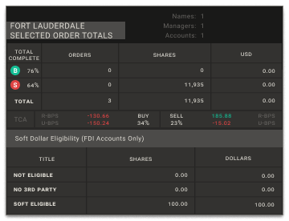

# FTI Component: 

------

## Architecture & Definition

------

## Description

------

## Theming

### Shape

### Color

### Typography

------

## Behavior

| Characteristic         | Description |
| ---------------------- | ----------- |
| Selectable (Clickable) |             |
| Dynamic or Static      |             |
|                        |             |

Dynamic or Static:

The above text is static: "Selected Order Totals", "Names", "Managers", "Accounts", "Total Complete", "Orders", "Shares", "Title", "Shares", "Dollars"

Behavior Reference: 

## Usage

| Variation | Usage | Token | Text | Color | Swatch |
| --------- | ----- | ----- | ---- | ----- | ------ |
|           |       |       |      |       |        |
|           |       |       |      |       |        |

