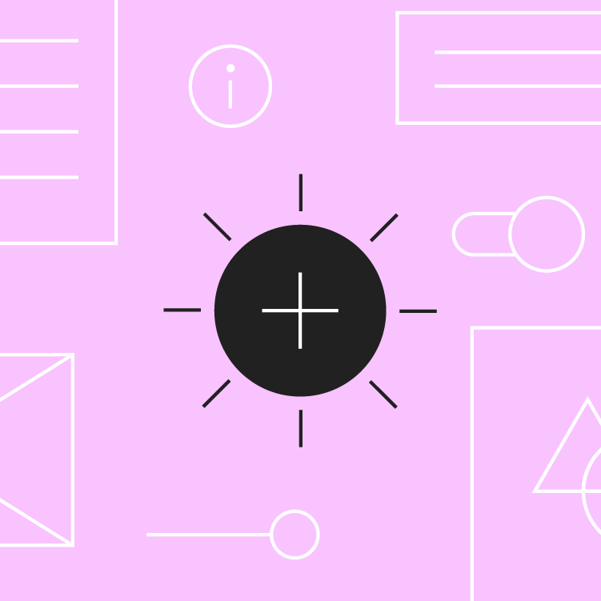
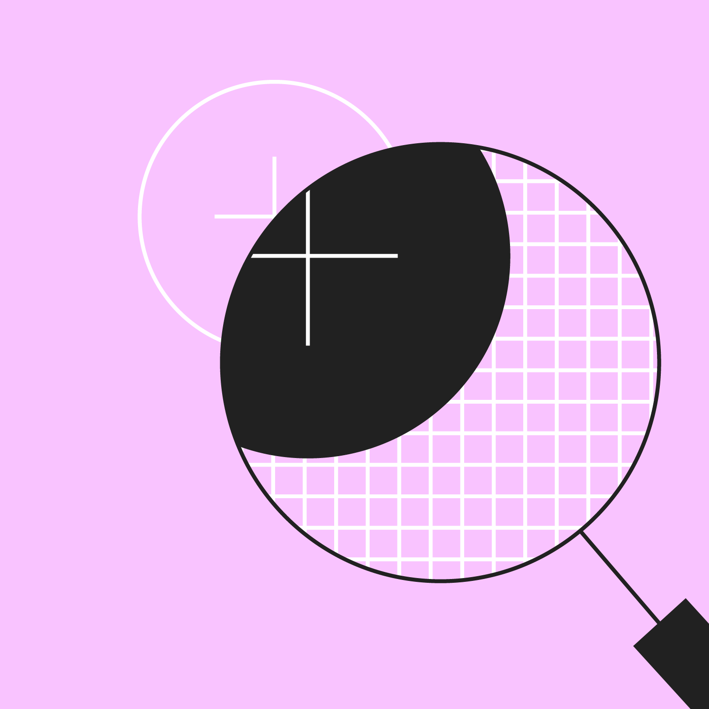
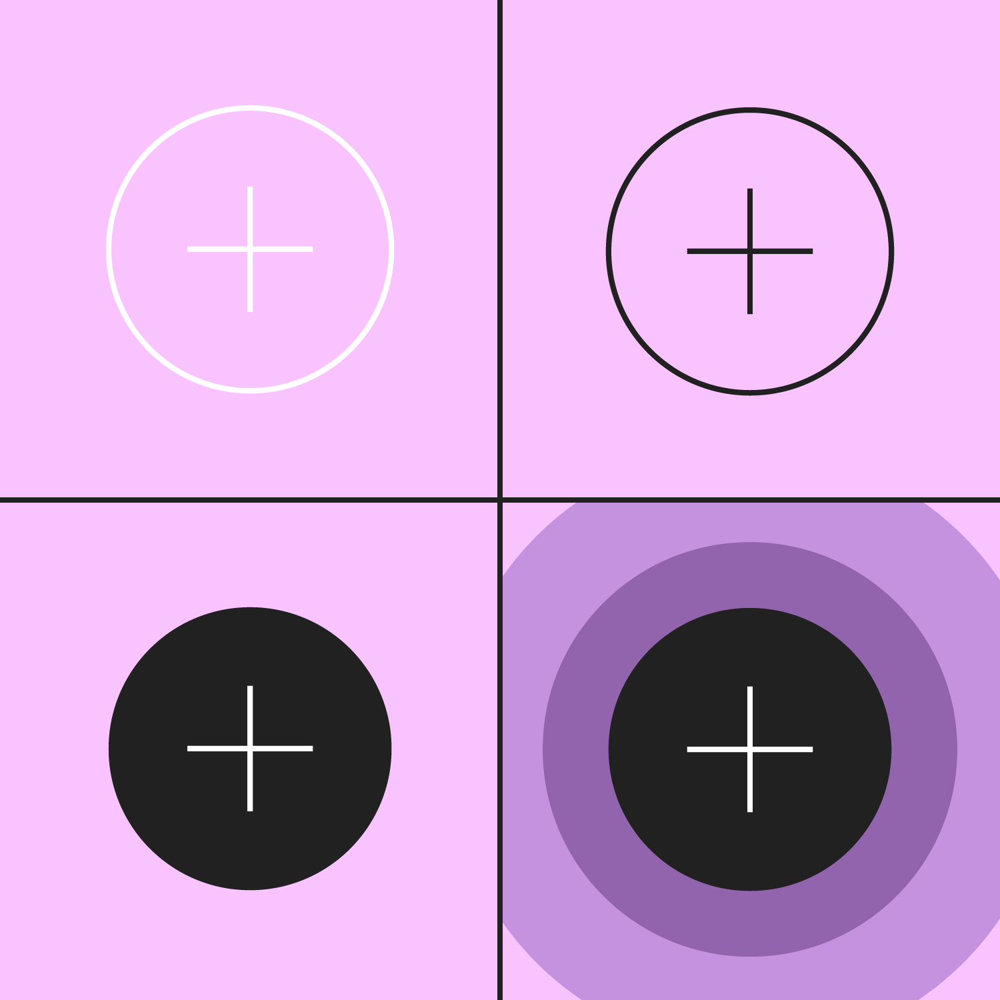
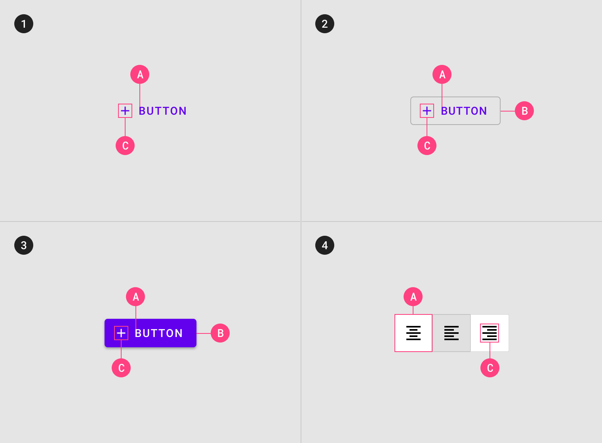

# MUI Component Documentation: Buttons

[Material Guidelines](https://material.io/design/components/buttons.html#) - this is a link to the live documentation that had previously been pasted into [confluence](http://confluence.corp.frk.com:8090/display/EB/Buttons).  

### Interactive Demo

<!---
### [Interactive Demo - Link to Storybook]("tbd")
--->

---
## Usage

Buttons communicate actions that users can take. They are typically placed throughout your UI, in places like:
- Dialogs
- Modal windows
- Forms
- Cards
- Toolbars

### Principles

Identifiable | Findable | Clear
--- | --- | ---
 |  | 
Buttons should indicate that they can trigger an action. | Buttons should be easy to find among other elements, including other buttons. | A button’s action and state should be clear.

### Types

1. **Text button** (low emphasis)
Text buttons are typically used for less important actions.

2. **Outlined Button** (medium emphasis)
Outlined buttons are used for more emphasis than text buttons due to the stroke.

3. **Contained button** (high emphasis)
Contained buttons have more emphasis, as they use use a color fill and shadow.

4. **Toggle button**
Toggle buttons group a set of actions using layout and spacing. They’re used less often than other button types.

---
## Anatomy

Buttons contain one required element and four optional elements.

1. Text button
A. Text label
C. Icon (optional)

2. Outlined button
A. Text label
B. Container
C. Icon (optional)

3. Contained button
A. Text label
B. Container
C. Icon (optional)

4. Toggle button
A. Container
C. Icon

### Text label

Text buttons and contained buttons use text labels, which describe the action that will occur if a user taps a button. If a text label is not used, an icon should be present to signify what the button does.

By default Material uses capitalized button text labels (for languages that have capitalization). This is to distinguish the text label from surrounding text. If a text button does not use capitalization for button text, find another characteristic to distinguish it such as color, size, or placement.

<!--- STOPPED HERE | JJAMES 2019.06.18 10:46 AM --->

---
## Hierarchy and placement

---
## Text button

---
## Outlined button

---
## Contained button

---
## Toggle button

---
## Theming

---
## Specs

---
## Implementation

---
[React Guidelines](https://material-ui.com/components/buttons/)

[Storybook](http:// "This documentation will be embedded as a note in the corresponding storybook page for this component")

---
---
Buttons allow users to take actions, and make choices, with a single tap.

Equity Trading > Buttons > image2019-4-11_10-40-2.png

CONTENTS

Usage
Anatomy
Hierarchy and placement
Text button
Outlined button
Contained button
Toggle button
Theming
Specs
Implementation
Usage
Buttons communicate actions that users can take. They are typically placed throughout your UI, in places like:

Dialogs
Modal windows
Forms
Cards
Toolbars

Principles
Buttons are identifiable, findable, and specific.

Identifiable
Buttons should indicate that they can trigger an action.

Findable
Buttons should be easy to find among other elements, including other buttons.

Clear
A button’s action and state should be clear.

Applying color to UI
In a UI, color has a variety of roles: from containing meaning, to expressing a look and feel.

Types

There are text, contained, and toggle buttons.

Text button (low emphasis)
Text buttons are typically used for less important actions.
Outlined Button (medium emphasis)
Outlined buttons are used for more emphasis than text buttons due to the stroke.
Contained button (high emphasis)
Contained buttons have more emphasis, as they use use a color fill and shadow.
Toggle button
Toggle buttons group a set of actions using layout and spacing. They’re used less often than other button types.
Anatomy
Buttons contain one required element and four optional elements.

Text button
A. Text label
C. Icon (optional)

Contained button
A. Text label
B. Container
C. Icon (optional)

Outlined button
A. Text label
B. Container
C. Icon (optional)

Toggle button
A. Container
C. Icon

Text label
Text buttons and contained buttons use text labels, which describe the action that will occur if a user taps a button. If a text label...

Text buttons and contained buttons use text labels, which describe the action that will occur if a user taps a button. If a text label is not used, an icon should be present to signify what the button does.

By default Material uses capitalized button text labels (for languages that have capitalization). This is to distinguish the text label from surrounding text. If a text button does not use capitalization for button text, find another characteristic to distinguish it such as color, size, or placement.

Do.

Use capitalization, for languages that allow capitalization.

Don’t.

Don’t wrap text. For maximum legibility, a text label should remain on a single line.

Hierarchy and placement

Hierarchy

A layout should contain a single prominent button that makes it clear that other buttons have less importance in the hierarchy. This high-emphasis button commands...

A single, prominent button
A layout should contain a single prominent button that makes it clear that other buttons have less importance in the hierarchy. This high-emphasis button commands the most attention.

Other buttons
An app can show more than one button in a layout at a time, so a high-emphasis button can be accompanied by medium- and low-emphasis buttons that perform less important actions. When using multiple buttons, ensure the available state of one button doesn’t look like the disabled state of another.

A button’s level of emphasis helps determine its appearance, typography, and placement.

Placement

Multiple button types can be used to express different emphasis levels. A floating action button (FAB) represents the primary action for a screen. Related Article...

Multiple button types can be used to express different emphasis levels.

This screen layout uses:

An extended floating action button for the highest emphasis
A contained button for high emphasis
A text button for low emphasis
Floating Action Button
A floating action button (FAB) represents the primary action for a screen.

Do.

In a bottom bar, when using multiple buttons, indicate the more important action by placing it in a contained button (next to a text button).

Don’t.

Avoid using two contained buttons next to one another if they don’t have the same fill color.

Do.

In a bottom bar, when using multiple buttons, you can place a outlined button (medium emphasis) next to a contained button (high emphasis).

Do.

When using multiple buttons in a bottom bar, you can place a text button (low emphasis) next to an outlined button (medium emphasis).

Do.

Use a contained button in a bottom sheet next to other important details.

Don’t.

Don’t place a button below another button if there is space to place them side by side.

Text button

Usage

Text buttons are typically used for less-pronounced actions, including those located: In cards, text buttons help maintain an emphasis on card content. A button’s text...

Text buttons are typically used for less-pronounced actions, including those located:

In dialogs
In cards
In cards, text buttons help maintain an emphasis on card content.

Text button

Use a text button in snackbars.

A text button against an image background

Text label
A button’s text label is the most important element on a button, as it communicates the action that will be performed when the user touches it.

Text label using a distinct action

Caution.

Text labels need to be distinct from other elements. If the text label isn’t capitalized, it should use a different color, style, or layout from other text.

Don’t.

Avoid text labels that are too long. They should be concise.

Placement

Text buttons are often embedded in contained components like cards and dialogs, in order to relate themselves to the component in which they appear. Because...

Text buttons are often embedded in contained components like cards and dialogs, in order to relate themselves to the component in which they appear. Because text buttons don’t have a container, they don’t distract from nearby content.

Dialogs use text buttons because the absence of a container helps unify the action with the dialog text. Align text buttons to the right edge for left-to-right scripts.

Text buttons minimize distraction from card content.

States

Text buttons can be placed in front of a variety of backgrounds. Until the button is interacted with, its container isn’t visible. To maintain accessibility,...

Text buttons can be placed in front of a variety of backgrounds. Until the button is interacted with, its container isn’t visible.

To maintain accessibility, Material Design provides baseline opacity values for the color overlays used by states. A brand can adjust opacity values to suit its color scheme.

States
States are visual representations used to communicate the status of a component or interactive element.

Text button states

Outlined button

Usage

Outlined buttons are medium-emphasis buttons. They contain actions that are important, but aren’t the primary action in an app. Outlined buttons are also a lower...

Outlined buttons are medium-emphasis buttons. They contain actions that are important, but aren’t the primary action in an app.

Alternatives
Outlined buttons are also a lower emphasis alternative to contained buttons, or a higher emphasis alternative to text buttons.

Container

Outlined buttons display a stroke around a text label. Stroke can be represented in different ways: In a resting state, outlined buttons should display containment...

Outlined buttons display a stroke around a text label. Stroke can be represented in different ways:

Set a button’s width to be the size of the text label, with 16dp padding on the left and right
Set the button’s relative position to the responsive layout grid
In a resting state, outlined buttons should display containment with a stroke and no fill.

Outlined button

Do.

An outlined button’s width is dynamically set to fit the text label.

Don’t.

An outlined button’s width shouldn’t be shorter than its text.

Caution.

Protect text when using Outlined buttons in front of images. This image uses a light purple scrim to provide text protection for this outlined button.

States

Outlined buttons can be placed on top of a variety of backgrounds. Its container is transparent and until the button is interacted with, a color...

Outlined buttons can be placed on top of a variety of backgrounds. Its container is transparent and until the button is interacted with, a color isn’t visible.

To maintain accessibility, Material Design provides baseline opacity values for the color overlays used by states. A brand can adjust opacity values to suit its color scheme.

States
States are visual representations used to communicate the status of a component or interactive element.

Outlined button states

Contained button

Usage

Contained buttons are high-emphasis, distinguished by their use of elevation and fill. They contain actions that are primary to your app.

Contained buttons are high-emphasis, distinguished by their use of elevation and fill. They contain actions that are primary to your app.

A contained button

Do.

Text labels can be written in sentence case, as long as the button is clearly distinguishable from elements around it.

Container

Contained buttons display a container around a text label. Containers can be represented in different ways: Contained buttons should display containers with a solid color....

Contained buttons display a container around a text label. Containers can be represented in different ways:

Set container width to the size of the text label with 16dp padding on the left and right
Set the container’s relative position to the responsive layout grid
Contained buttons should display containers with a solid color.

A contained button with solid color

Do.

A button container’s width is dynamically set to fit its text label.

Don’t.

A button container’s width shouldn’t be shorter than its text.

Button container width can be set according to the responsive layout grid.

Contained button in a responsive layout grid

Icon

Contained buttons can place icons next to text labels to both clarify an action and call attention to a button.

Contained buttons can place icons next to text labels to both clarify an action and call attention to a button.

Do.

Use icons that clearly communicate their meaning.

Don’t.

Don’t vertically align an icon and text in the center of a contained button.

Don’t.

Don’t use two icons in the same button.

Shadow & elevation

Buttons at higher elevations typically appear more prominent in a design. On press, elevated buttons lift up and the container displays touch feedback.

Buttons at higher elevations typically appear more prominent in a design. On press, elevated buttons lift up and the container displays touch feedback.

Higher elevation increases the prominence of a contained button.

States

The following opacity values are recommended for button container fill colors. Each app can alter the overlay values to suit their brand’s color palette. States...

The following opacity values are recommended for button container fill colors. Each app can alter the overlay values to suit their brand’s color palette.

States
States are visual representations used to communicate the status of a component or interactive element.

Contained button states

Toggle button

Usage

Toggle buttons can be used to group related options. To emphasize groups of related toggle buttons, a group should share a common container. Only one...

Toggle buttons can be used to group related options. To emphasize groups of related toggle buttons, a group should share a common container.

Selected action
Only one option in a group of toggle buttons can be selected and active at a time. Selecting one option deselects any other.

These toggle buttons present options for aligning text to the left, right, and center.

Icons can be used as toggle buttons when they allow selection, or deselection, of a single choice, such as marking an item as a favorite.

States

A toggle button’s state makes it clear which button is active. Hover and focus states express the available selection options for buttons in a toggle...

Active and available toggle buttons
A toggle button’s state makes it clear which button is active. Hover and focus states express the available selection options for buttons in a toggle group.

Disabled toggle buttons
Toggle buttons that cannot be selected can either be given a disabled state, or be hidden.

States
States are visual representations used to communicate the status of a component or interactive element.

Toggle button states

Theming

Crane Material theme

This travel app’s buttons have been customized using Material Theming. Areas of customization include color, typography, and shape. Crane is a travel app that uses...

This travel app’s buttons have been customized using Material Theming. Areas of customization include color, typography, and shape.

Crane’s customized buttons

Crane
Crane is a travel app that uses Material Design components and Material Theming to create a personalized on-brand experience.

The Color System
The Material Design color system helps you choose colors for your user interface.

Applying color to UI
In a UI, color has a variety of roles: from containing meaning, to expressing a look and feel.

Color
Crane’s buttons uses custom color on two elements: the container and text.

Element

Category

Attribute

Value

Container

Primary

Color

Opacity

#5C1349

100%

Text

On Primary

Color

Opacity

#FFFFFF

100%

Typography
Crane’s buttons use custom typography for the button text.

Element

Category

Attribute

Value

Text

Button

Typeface

Font

Size

Case

Raleway

SemiBold

14

All caps

About Shape
Material surfaces can be displayed in different shapes. Shapes direct attention, identify components, communicate state, and express brand.

Understanding typography
Typography is critical in establishing hierarchy and expressing brand presence that supports an effective digital experience.

Shape
Crane’s button containers have custom corner shapes, with a 50% corner radius.

Element

Category

Attribute

Value

Container

Override*

Family

Size

Rounded

50%

*Crane buttons use an override of the small component shape category size value.*

Fortnightly Material theme

This news app’s buttons have been customized using Material Theming. Areas of customization include color and typography. Fortnightly is a news app that uses Material...

This news app’s buttons have been customized using Material Theming. Areas of customization include color and typography.

Fortnightly’s customized buttons

Fortnightly
Fortnightly is a news app that uses Material Design components and Material Theming to create an on-brand, content-focused experience.

The Color System
The Material Design color system helps you choose colors for your user interface.

Applying color to UI
In a UI, color has a variety of roles: from containing meaning, to expressing a look and feel.

Color
Fortnightly’s buttons uses custom color on two elements: background and text.

Element

Category

Attribute

Value

Background

Background

Color

Opacity

#FFFFFF

100%

Text

Primary

Color

Opacity

#661FFF

100%

Understanding typography
Typography is critical in establishing hierarchy and expressing brand presence that supports an effective digital experience.

Typography
Fortnightly’s buttons use custom typography for the button text.

Element

Category

Attribute

Value

Text

Button

Typeface

Font

Size

Case

Libre Franklin

ExtraBold

14

Sentence case

Rally Material theme

This personal finance app’s buttons have been customized using Material Theming. Areas of customization include color and typography. Rally is a personal finance app that...

This personal finance app’s buttons have been customized using Material Theming. Areas of customization include color and typography.

Rally’s customized buttons

Rally
Rally is a personal finance app that demonstrates how Material Design can be used for finance.

The Color System
The Material Design color system helps you choose colors for your user interface.

Applying color to UI
In a UI, color has a variety of roles: from containing meaning, to expressing a look and feel.

Color
Rally’s buttons uses custom color on two elements: background and text.

Element

Category

Attribute

Value

Background

Surface

Color

Opacity

#3C3C46

100%

Text

Primary

Color

Opacity

#FFFFFF

100%

Understanding typography
Typography is critical in establishing hierarchy and expressing brand presence that supports an effective digital experience.

Typography
Rally’s buttons use custom typography for the button text.

Element

Category

Attribute

Value

Text

Button

Typeface

Font

Size

Case

Roboto Condensed

Bold

14

All caps

Posivibes Material theme

This social media app’s buttons have been customized using Material Theming. Areas of customization include color, typography, and shape. The Material Design color system helps...

This social media app’s buttons have been customized using Material Theming. Areas of customization include color, typography, and shape.

Posivibe’s customized buttons

The Color System
The Material Design color system helps you choose colors for your user interface.

Applying color to UI
In a UI, color has a variety of roles: from containing meaning, to expressing a look and feel.

Color
Posivibe’s buttons uses custom color on two elements: the container stroke and text.

Element

Category

Attribute

Value

Container stroke

Secondary

Color

Opacity

#000000

100%

Text

Primary

Color

Opacity

#000000

100%

Typography
Posivibe’s buttons use custom typography for the button text.

Element

Category

Attribute

Value

Text

Button

Typeface

Font

Size

Case

Roboto Condensed

Bold

14

All caps

About Shape
Material surfaces can be displayed in different shapes. Shapes direct attention, identify components, communicate state, and express brand.

Understanding typography
Typography is critical in establishing hierarchy and expressing brand presence that supports an effective digital experience.

Shape
Posivibe’s button containers have custom corner shapes, with 0dp long cut corners.

Element

Category

Attribute

Value

Container

Small component

Family

Size

Cut

0;0;0;0dp

Reply Material theme

This email app’s buttons have been customized using Material Theming. Areas of customization include color and typography. Reply is an email app that uses Material...

This email app’s buttons have been customized using Material Theming. Areas of customization include color and typography.

Reply’s customized buttons.

Reply
Reply is an email app that uses Material Design components and Material Theming to create an on-brand communication experience.

The Color System
The Material Design color system helps you choose colors for your user interface.

Applying color to UI
In a UI, color has a variety of roles: from containing meaning, to expressing a look and feel.

Color
Reply’s buttons uses custom color on four elements: background, icon, icon fill, and text.

Element

Category

Attribute

Value

Background

Surface

Color

Opacity

#FFFFFF

100%

Icon

Primary

Color

Opacity

#344955

100%

Icon fill

On Primary

Color

Opacity

#344955

30%

Text

Primary

Color

Opacity

#344955

100%

Understanding typography
Typography is critical in establishing hierarchy and expressing brand presence that supports an effective digital experience.

Typography
Reply’s buttons use custom typography for the button text.

Element

Category

Attribute

Value

Text

Button

Typeface

Font

Size

Case

Work Sans

ExtraBold

15

All caps

Shrine Material theme

This retail app’s buttons have been customized using Material Theming. Areas of customization include color, typography, and shape. Shrine is a lifestyle and fashion brand...

This retail app’s buttons have been customized using Material Theming. Areas of customization include color, typography, and shape.

Shrine’s customized buttons

Shrine
Shrine is a lifestyle and fashion brand that demonstrates how Material Design can be used in e-commerce.

The Color System
The Material Design color system helps you choose colors for your user interface.

Applying color to UI
In a UI, color has a variety of roles: from containing meaning, to expressing a look and feel.

Color
Shrine’s buttons uses custom color on three elements: the container, icon, and text.

Element

Category

Attribute

Value

Container

Primary

Color

Opacity

#FEDBD0

100%

Icon

On Primary

Color

Opacity

#442C2E

100%

Text

On Primary

Color

Opacity

#442C2E

100%

Typography
Shrine’s buttons use custom typography for the button text.

Element

Category

Attribute

Value

Text

Button

Typeface

Font

Size

Case

Rubik

Medium

14

All caps

Understanding typography
Typography is critical in establishing hierarchy and expressing brand presence that supports an effective digital experience.

About Shape
Material surfaces can be displayed in different shapes. Shapes direct attention, identify components, communicate state, and express brand.

Shape
Shrine’s button containers have custom corner shapes, with cut corner shapes.

Element

Category

Attribute

Value

Container

Small component

Family

Size

Cut

4dp; 4dp; 4dp; 4dp

Specs
Contained Button
CMeasurement C
36Measurement 36
min-width: 64dpMeasurement min-width: 64dp
16Measurement 16
16Measurement 16
flip

Specs

Contained Button with icon
8Measurement 8
12Measurement 12
16Measurement 16
36Measurement 36
min-width: 64dpMeasurement min-width: 64dp
CMeasurement C
18
flip

Specs

Outlined Button
CMeasurement C
16Measurement 16
16Measurement 16
36Measurement 36
min-width: 64dp Measurement min-width: 64dp
1Measurement 1
flip

Specs

Text Button
36Measurement 36
min-width: 64dpMeasurement min-width: 64dp
8Measurement 8
8Measurement 8
CMeasurement C
flip

Specs

Toggle Buttons
48Measurement 48
12Measurement 12
12Measurement 12
12Measurement 12
12Measurement 12
48Measurement 48
1Measurement 1
24
flip

Specs

Implementation
Buttons implementation support for each platform is indicated below.

Android Implementation-Bottom App Bar

IOS Implementation-Bottom App Bar

Android Material Component
Status: Available

IOS Material Component
Status: Available

Flutter Implementation-Bottom App Bar

Web Implementation-Bottom App Bar

Flutter Material Component
Status: Available

Web Material Component
Status: Available
