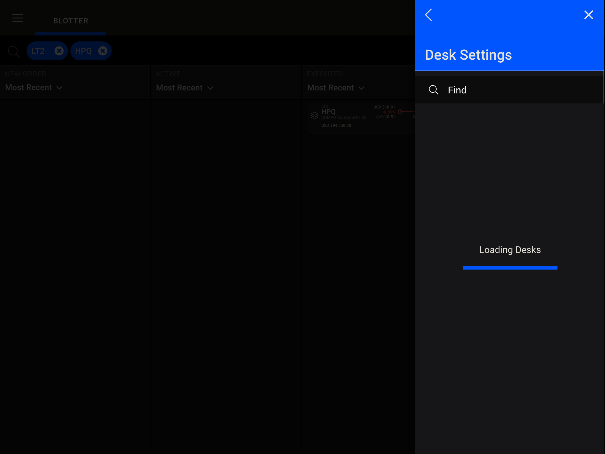

# Progress Indicators

Material UI (Core) Component

Reference: https://material.io/design/components/progress-indicators.html

Example usage within fti-blotter:

(Reference https://projects.invisionapp.com/share/ZRTLB6O7VJB)

------

# Progress indicators 

## Progress indicators express an unspecified wait time or display the length of a process.

<video class="video-player__video animatable js-video-player js-video-load anim-appear" loop="" muted="" preload="metadata" tabindex="0" style="background-repeat: no-repeat; box-sizing: border-box; display: block; opacity: 1 !important; position: absolute; top: 0px; transition: opacity 235ms cubic-bezier(0.4, 0, 0.2, 1) 0s, top 500ms cubic-bezier(0.4, 0, 0.2, 1) 0s; bottom: 0px; left: 0px; right: 0px; max-width: 100%;"></video>
CONTENTS[Usage](https://material.io/design/components/progress-indicators.html#usage)[Linear progress indicators](https://material.io/design/components/progress-indicators.html#linear-progress-indicators)[Circular progress indicators](https://material.io/design/components/progress-indicators.html#circular-progress-indicators)[Specs](https://material.io/design/components/progress-indicators.html#specs)[Implementation](https://material.io/design/components/progress-indicators.html#implementation)

------

## Usage 

Progress indicators inform users about the status of ongoing processes, such as loading an app, submitting a form, or saving updates. They communicate an app’s state and indicate available actions, such as whether users can navigate away from the current screen.

## Progress as a group

When displaying progress for a sequence of processes, indicate overall progress rather than the progress of each activity.

# Principles

Progress indicators look and animate in ways that reflect the status of a process. They are never simply decorative. Progress indicators use animation to capture...

READ MORE

## Informative

Progress indicators look and animate in ways that reflect the status of a process. They are never simply decorative.

## Animated

Progress indicators use animation to capture attention and inform users of an activity’s progress.

## Consistent

Progress indicators should be applied to all instances of a process (such as loading) in a consistent format (linear or circular).

# Types

Material Design offers two visually distinct types of progress indicators: linear and circular progress indicators. Only one type should represent each kind of activity in...

READ MORE

## Linear and circular

Material Design offers two visually distinct types of progress indicators: linear and circular progress indicators. Only one type should represent each kind of activity in an app. For example, if a refresh action displays a circular indicator on one screen, that same action shouldn’t use a linear indicator elsewhere in the app.

<video class="video-player__video animatable js-video-player js-video-load anim-appear" loop="" muted="" preload="metadata" tabindex="0" style="background-repeat: no-repeat; box-sizing: border-box; display: block; opacity: 1 !important; position: absolute; top: 0px; transition: opacity 235ms cubic-bezier(0.4, 0, 0.2, 1) 0s, top 500ms cubic-bezier(0.4, 0, 0.2, 1) 0s; bottom: 0px; left: 0px; right: 0px; max-width: 100%;"></video>
Linear indicatorCircular indicator

## Determinate and indeterminate

Progress indicators may be determinate or indeterminate:

## Determinate indicators

**Determinate indicators** display how long a process will take. They should be used when the process completion rate can be detected.

## Indeterminate indicators

**Indeterminate indicators** express an unspecified amount of wait time. They should be used when progress isn’t detectable, or if it’s not necessary to indicate how long an activity will take.

<video class="video-player__video animatable js-video-player js-video-load anim-appear" loop="" muted="" preload="metadata" tabindex="0" style="background-repeat: no-repeat; box-sizing: border-box; display: block; opacity: 1 !important; position: absolute; top: 0px; transition: opacity 235ms cubic-bezier(0.4, 0, 0.2, 1) 0s, top 500ms cubic-bezier(0.4, 0, 0.2, 1) 0s; bottom: 0px; left: 0px; right: 0px; max-width: 100%;"></video>
Determinate progress indicators fill from 0 to 100%.Indeterminate progress indicators move along a fixed track, growing and shrinking in size.

As more information about a process becomes available, a progress indicator can switch from an indeterminate to a determinate state.

<video class="video-player__video animatable js-video-player js-video-load anim-appear" loop="" muted="" preload="metadata" tabindex="0" style="background-repeat: no-repeat; box-sizing: border-box; display: block; opacity: 1 !important; position: absolute; top: 0px; transition: opacity 235ms cubic-bezier(0.4, 0, 0.2, 1) 0s, top 500ms cubic-bezier(0.4, 0, 0.2, 1) 0s; bottom: 0px; left: 0px; right: 0px; max-width: 100%;"></video>
A linear progress indicator changes from indeterminate to determinate while loading a screen.

------

## Linear progress indicators 

# Anatomy

The track is a fixed width rule, with set boundaries for the indicator to travel along. The indicator animates along the length of the track.

READ MORE

### Linear progress indicators are composed of two required elements:

### 1. Track

The track is a fixed width rule, with set boundaries for the indicator to travel along.

### 2. Indicator

The indicator animates along the length of the track.

# Behavior

Linear progress indicators display progress by animating an indicator along the length of a fixed, visible track. The behavior of the indicator is dependent on...

READ MORE

Linear progress indicators display progress by animating an indicator along the length of a fixed, visible track. The behavior of the indicator is dependent on whether the progress of a process is known.

# Types

Linear progress indicators support both determinate and indeterminate operations.

READ MORE

Linear progress indicators support both determinate and indeterminate operations.

- **Determinate** operations display the indicator increasing in width from 0 to 100% of the track, in sync with the process’s progress.
- **Indeterminate** operations display the indicator continually growing and shrinking along the track until the process is complete.

------

<video class="video-player__video animatable js-video-player js-video-load anim-appear" loop="" muted="" preload="metadata" tabindex="0" style="background-repeat: no-repeat; box-sizing: border-box; display: block; opacity: 1 !important; position: absolute; top: 0px; transition: opacity 235ms cubic-bezier(0.4, 0, 0.2, 1) 0s, top 500ms cubic-bezier(0.4, 0, 0.2, 1) 0s; bottom: 0px; left: 0px; right: 0px; max-width: 100%;"></video>
Determinate linear progress indicator

<video class="video-player__video animatable js-video-player js-video-load anim-appear" loop="" muted="" preload="metadata" tabindex="0" style="background-repeat: no-repeat; box-sizing: border-box; display: block; opacity: 1 !important; position: absolute; top: 0px; transition: opacity 235ms cubic-bezier(0.4, 0, 0.2, 1) 0s, top 500ms cubic-bezier(0.4, 0, 0.2, 1) 0s; bottom: 0px; left: 0px; right: 0px; max-width: 100%;"></video>
Indeterminate linear progress indicator

# Placement

The placement of a linear progress indicator can indicate the scope of a process. For example:

READ MORE

The placement of a linear progress indicator can indicate the scope of a process. For example:

- A linear indicator at the center of the screen can indicate loading all screen content
- A linear indicator attached to a container, such as a card, can indicate the process applies to that particular item (and that interaction with the rest of the UI is possible)
- Expanding items can place a linear indicator along their expanding edge to draw user attention to where new content will appear

------

<video aria-describedby="linear-progress-indicators-figure-caption-0" class="video-player__video animatable js-video-player js-video-load anim-appear" loop="" muted="" preload="metadata" tabindex="0" style="background-repeat: no-repeat; box-sizing: border-box; display: block; opacity: 1 !important; position: absolute; top: 0px; transition: opacity 235ms cubic-bezier(0.4, 0, 0.2, 1) 0s, top 500ms cubic-bezier(0.4, 0, 0.2, 1) 0s; bottom: 0px; left: 0px; right: 0px; max-width: 100%;"></video>
To indicate that loading affects the whole screen, a linear indicator can be placed in the background.

<video aria-describedby="linear-progress-indicators-figure-caption-1" class="video-player__video animatable js-video-player js-video-load anim-appear" loop="" muted="" preload="metadata" tabindex="0" style="background-repeat: no-repeat; box-sizing: border-box; display: block; opacity: 1 !important; position: absolute; top: 0px; transition: opacity 235ms cubic-bezier(0.4, 0, 0.2, 1) 0s, top 500ms cubic-bezier(0.4, 0, 0.2, 1) 0s; bottom: 0px; left: 0px; right: 0px; max-width: 100%;"></video>
To focus user attention, a linear indicator is recommended for displaying item expansion onto larger surfaces, such as desktop.

------

## Circular progress indicators 

# Behavior

Circular progress indicators display progress by animating an indicator along an invisible circular track in a clockwise direction. They can be applied directly to a...

READ MORE

Circular progress indicators display progress by animating an indicator along an invisible circular track in a clockwise direction. They can be applied directly to a surface, such as a button or card.

On Android, the “swipe to refresh” gesture displays a circular progress indicator to indicate that the UI is being refreshed.

[Android swipe to refreshSwipe to refresh manually refreshes screen content with a user action or gesture.Related Article*arrow_downward*](https://material.io/design/platform-guidance/android-swipe-to-refresh.html#android-swipe-to-refresh)

# Types

Circular progress indicators support both determinate and indeterminate processes.

READ MORE

Circular progress indicators support both determinate and indeterminate processes.

- **Determinate** circular indicators fill the invisible, circular track with color, as the indicator moves from 0 to 360 degrees.
- **Indeterminate** circular indicators grow and shrink in size while moving along the invisible track.

------

<video class="video-player__video animatable js-video-player js-video-load anim-appear" loop="" muted="" preload="metadata" tabindex="0" style="background-repeat: no-repeat; box-sizing: border-box; display: block; opacity: 1 !important; position: absolute; top: 0px; transition: opacity 235ms cubic-bezier(0.4, 0, 0.2, 1) 0s, top 500ms cubic-bezier(0.4, 0, 0.2, 1) 0s; bottom: 0px; left: 0px; right: 0px; max-width: 100%;"></video>
Determinate circular progress indicator

<video class="video-player__video animatable js-video-player js-video-load anim-appear" loop="" muted="" preload="metadata" tabindex="0" style="background-repeat: no-repeat; box-sizing: border-box; display: block; opacity: 1 !important; position: absolute; top: 0px; transition: opacity 235ms cubic-bezier(0.4, 0, 0.2, 1) 0s, top 500ms cubic-bezier(0.4, 0, 0.2, 1) 0s; bottom: 0px; left: 0px; right: 0px; max-width: 100%;"></video>
Indeterminate circular progress indicator

# Placement

Circular progress indicators are positioned to indicate the process that they represent. Buttons allow users to take actions with a single tap. Related Article arrow_downward...

READ MORE

Circular progress indicators are positioned to indicate the process that they represent.

- When centered on the screen, they indicate the initial loading of screen content.
- When placed above or below existing content, they draw attention to where new content will appear.

------

<video aria-describedby="circular-progress-indicators-figure-caption-0" class="video-player__video animatable js-video-player js-video-load anim-appear" loop="" muted="" preload="metadata" tabindex="0" style="background-repeat: no-repeat; box-sizing: border-box; display: block; opacity: 1 !important; position: absolute; top: 0px; transition: opacity 235ms cubic-bezier(0.4, 0, 0.2, 1) 0s, top 500ms cubic-bezier(0.4, 0, 0.2, 1) 0s; bottom: 0px; left: 0px; right: 0px; max-width: 100%;"></video>
A circular indicator centered on screen indicates an initial loading process.

<video aria-describedby="circular-progress-indicators-figure-caption-1" class="video-player__video animatable js-video-player js-video-load anim-appear" loop="" muted="" preload="metadata" tabindex="0" style="background-repeat: no-repeat; box-sizing: border-box; display: block; opacity: 1 !important; position: absolute; top: 0px; transition: opacity 235ms cubic-bezier(0.4, 0, 0.2, 1) 0s, top 500ms cubic-bezier(0.4, 0, 0.2, 1) 0s; bottom: 0px; left: 0px; right: 0px; max-width: 100%;"></video>
An indicator appears where new items will appear, at the end of the current items grid.

[ButtonsButtons allow users to take actions with a single tap.Related Article*arrow_downward*](https://material.io/design/components/buttons.html#buttons)

## Integrating with actions

A circular indicator can be integrated into a button or actionable icon to express a connection between an interaction and a specific item. They are typically used to express when an interaction, such as clicking a button again, isn’t available.

They should be used for short, indeterminate activities (between 2-5 seconds). Longer activities may require alternate methods of communication, such as snackbars or notifications.

<video aria-describedby="circular-progress-indicators-figure-caption-2" class="video-player__video animatable js-video-player js-video-load anim-appear" loop="" muted="" preload="metadata" tabindex="0" style="background-repeat: no-repeat; box-sizing: border-box; display: block; opacity: 1 !important; position: absolute; top: 0px; transition: opacity 235ms cubic-bezier(0.4, 0, 0.2, 1) 0s, top 500ms cubic-bezier(0.4, 0, 0.2, 1) 0s; bottom: 0px; left: 0px; right: 0px; max-width: 100%;"></video>
Do.

Use circular indicators for short, indeterminate activities (< 5 seconds) requiring user attention.

<video aria-describedby="circular-progress-indicators-figure-caption-3" class="video-player__video animatable js-video-player js-video-load anim-appear" loop="" muted="" preload="metadata" tabindex="0" style="background-repeat: no-repeat; box-sizing: border-box; display: block; opacity: 1 !important; position: absolute; top: 0px; transition: opacity 235ms cubic-bezier(0.4, 0, 0.2, 1) 0s, top 500ms cubic-bezier(0.4, 0, 0.2, 1) 0s; bottom: 0px; left: 0px; right: 0px; max-width: 100%;"></video>
Don’t.

Don’t apply progress indicators to every button in your app. They can unnecessarily interrupt the user’s task.

------

## Specs 

## Circular indicators

- 4848
- 4848

- 

  

  

  

  

  

- 

  

  

  

  

  

- 

  

  

  

  

  

*flip*

Specs

## Determinate indicators

- 4Measurement 4
- 144 Measurement 144
- 240 Measurement 240

- 

  

  

  

  

  

- 

  

  

  

  

  

- 

  

  

  

  

  

*flip*

Specs

## Indeterminate indicators

- 4Measurement 4
- 240 Measurement 240
- 112 Measurement 112

- 

  

  

  

  

  

- 

  

  

  

  

  

- 

  

  

  

  

  

*flip*

Specs

------

## Implementation 

Implementation support for progress indicators for each platform is indicated below.

## Android Material Component

**Status:** Planned

## [IOS Material Component](https://material.io/go/ios-progress-indicators/)

**Status:** Available

## [Flutter Material Component](https://material.io/go/flutter-progress-indicators/)

**Status:** Available

## [Web Material Component](https://material.io/go/web-progress-indicators/)

**Status:** Available