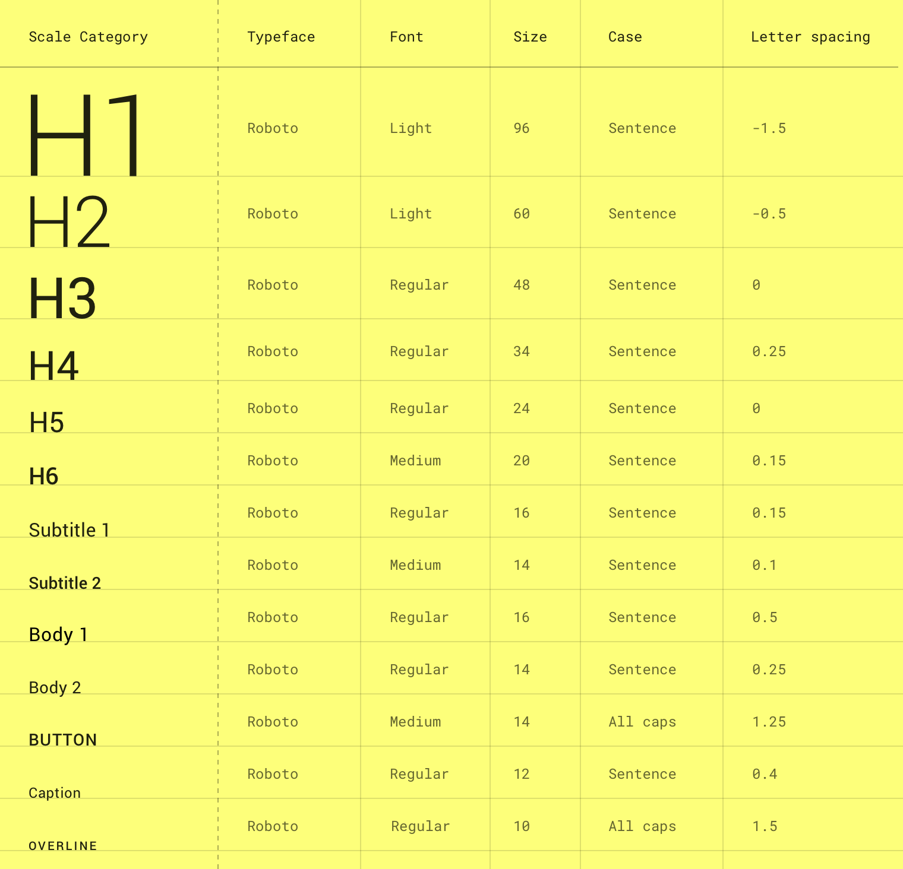

# Project Thor Documentation

---

## Introduction

Project Thor is Cross.Team's nickname for the next version of Franklin Templeton's (FTI) Equity Trading Blotter's frontend.  This project is one part of FTI's larger Equity Trading Modernization Project (ETM).

The goals of the project are to:
- increase the efficiency and effectiveness of users of the blotter by updating the user experience (UX) and user interface (UI)
- maximize performance of the blotter's frontend
- minimize design and development maintenance of the blotter once deployed.  

To meet these goals, the project will be delivered as a design system that will:
- utilize a design language to systematize the design process
- align the design and development process.  i.e. designs are componetized just like components in code.   
- build

---

## Project Resource List

This list serves to point designers and developers to all locations where project resources may be found.  The list will evolve and ideally be streamlined as the project moves forward.  

Resource | Description | Location
--- | --- | ---
Confluence | The overall Equity Trading Modernization project documentation is found in FTI's 'Equity Trading' Confluence space | http://confluence.corp.frk.com:8090/display/EB
UI Components | Confluence page listing links to components | http://confluence.corp.frk.com:8090/dislpay/EB/UI+Components
Project Plan | Confluence page.  Sub pages include UX research findings. |
Design System Documentation | Confluence page to be phased out |
Cross.Team's Thor Github Repository (temporary) | | https://github.com/cross-team/thor
Storybook | | http://az-imds-caasmanager01-dev.corp.frk.com:34001/

---

## How to Use This Documentation

### Markdown

This documentation is written in [markdown syntax](https://guides.github.com/features/mastering-markdown/) and saved as a markdown (.md) document.  Markdown is lightweight, easy to read, and widely used.    For quick syntax reference, see this [cheatsheet](https://github.com/adam-p/markdown-here/wiki/Markdown-Cheatsheet#links).

There are many tools to create and edit markdown documents.  This documentation was written in [Atom](https://atom.io/), a free, open source text editor.  (Atom even has integrated spell check!)

Markdown syntax is designed lightweight enough to be read directly, but you can also preview the rendered document in many text editors.  In Atom, to toggle the preview panel: `Menu -> Packages -> Markdown Preview -> Toggle Preview`.

It's worth mentioning why we're writing documentation in markdown and not an 'easier' or 'more user friendly' third party tool.  There are tools that create pretty, cleanly organized documentation that also automate some of the process.  We are concerned that in the future those tools may become more expensive, be bought out by a larger company that will change the tools or limit access, or cease all together.  Markdown lets us be documentation agnostic.  Should we later choose to use a third party tool, we can still do so by pushing this documentation to it, without relying on it as the source of truth.  

### Gittin' that Documentation

You're probably familiar with [git](https://git-scm.com/), the free and open source distributed version control system.  Since git works so well for pushing code, why not use it to push documentation?  

Documentation (.md) will be saved to the project repository and updated through git.  Just like code, multiple users will be able to edit documents and track version history.  The repository will serve as a 'source of truth' for all documentation, which can be viewed directly or pushed to other applications.  

Documentation should be scaffolded in the same way the code is.  Like this document, there will be high level documents discussing the product at a high level as well as separate documents discussing specific parts of the code.  For example, each component will have its own corresponding document (.md) with related documentation.  

---

## Concepts

### What is a design system?

### Design Systems: The Developer's Perspective

### Design Systems: The Designer's Perspective

### Design Systems: The Owner's Perspective

---

## Definitions
(See Rudy's Definitions)
- Token
- Component
- Pattern
- Master Pattern

---

## Design System Architecture

---

## Designing the Design System

### Principles

#### Atomic Design

#### Color

#### Typography

#### Shape

#### Grid (Size and Space)

#### Components

### What is Material?

#### Material

>Material is an adaptable system of guidelines, components, and tools that support the best practices of user interface design. Backed by open-source code, Material streamlines collaboration between designers and developers, and helps teams quickly build beautiful products.

[material.io](https://material.io/)

#### Material-UI

>The worlds most popular React UI framework.

>React components for faster and easier web development. Build your own design system, or start with Material Design.

[material-ui.com](https://material-ui.com/)
[material-ui repository](https://github.com/mui-org/material-ui)

### Figma

#### Using Teams, Files & Libraries in Figma

#### Using Color Styles in Figma

#### Using Text Styles in Figma

#### Using the Grid System in Figma

#### Using Theme Styles Configuration

#### Figma Material UI Theme Kit Version

#### FTI Custom Components and Patterns

#### Font Awesome Icon Font Version

## The Design System

### Design Tokens

#### Color

Color Tokens

Color | 	HUE (Name) | 	Shade | 	HEX |
--- | --- | --- | ---
Primary | 	ftiGrey | 	main (500) | 	7F7D79 |
Primary | 	ftiGrey | 	light | 	- |
Primary | 	ftiGrey | 	dark | 	- |
Primary | 	ftiGrey | 	contrastText | 	- |
Primary | 	ftiGrey | 	50 | 	F2EEE6 |
Primary | 	ftiGrey | 	100 | 	E5E2DA |
Primary | 	ftiGrey | 	200 | 	CCC9C2 |
Primary | 	ftiGrey | 	300 | 	B2B0AA |
Primary | 	ftiGrey | 	400 | 	999691 |
Primary | 	ftiGrey | 	450 | 	8C8A85 |
Primary | 	ftiGrey | 	500 | 	7F7D79 |
Primary | 	ftiGrey | 	550 | 	73716D |
Primary | 	ftiGrey | 	600 | 	666461 |
Primary | 	ftiGrey | 	650 | 	595855 |
Primary | 	ftiGrey | 	700 | 	4D4B49 |
Primary | 	ftiGrey | 	750 | 	403F3D |
Primary | 	ftiGrey | 	800 | 	333230 |
Primary | 	ftiGrey | 	850 | 	262524 |
Primary | 	ftiGrey | 	900 | 	1A1918 |
Primary | 	ftiGrey | 	950 | 	0D0D0C |
Secondary | 	ftiBlue | 	main (500+) | 	1ABCFE |
Secondary | 	ftiBlue | 	light | 	- |
Secondary | 	ftiBlue | 	dark | 	- |
Secondary | 	ftiBlue | 	contrastText | 	- |
Secondary | 	ftiBlue | 	50 | 	B2E9FF |
Secondary | 	ftiBlue | 	100 | 	98E1FE |
Secondary | 	ftiBlue | 	200 | 	7FD9FE |
Secondary | 	ftiBlue | 	300 | 	66D2FE |
Secondary | 	ftiBlue | 	400 | 	B2CCFF |
Secondary | 	ftiBlue | 	500+ | 	1ABCFE |
Secondary | 	ftiBlue | 	600 | 	99BBFF |
Secondary | 	ftiBlue | 	700 | 	6699FF |
Secondary | 	ftiBlue | 	800 | 	3377FF |
Secondary | 	ftiBlue | 	900 | 	0055FF |
Secondary | 	ftiBlue | 	950 | 	002B80 |
Error | 	Error | 	- | 	? |
SurfaceAppUI | 	SurfaceAppUI | 	- | 	191918 |
SurfaceAppBar | 	SurfaceAppBar | 	- | 	262624 |
SurfaceDrawers | 	SurfaceDrawers | 	- | 	0D0D0C |
SurfaceSideSheets | 	SurfaceSideSheets | 	- | 	0D0D0C |
SurfaceCardsBanners | 	SurfaceCardsBanners | 	- | 	161618 |
SurfaceSheets | 	SurfaceSheets | 	- | 	262624 |
SurfaceDialog | 	SurfaceDialog | 	- | 	333230 |
SurfaceMenu | 	SurfaceMenu | 	- | 	0D0D0C |
SurfaceSnackbar | 	SurfaceSnackbar | 	- | 	000000 |
TypeActive | 	TypeActive | 	- | 	E5E2DA |
TypeInactive | 	TypeInactive | 	- | 	666461 |
Positive | 	Positive | 	- | 	068062 |
Negative | 	Negative | 	- | 	BA1C1C |
BuyA11Y | 	BuyA11Y | 	- | 	13BE95 |
SellA11Y | 	SellA11Y | 	- | 	DF4444 |

Reference
[Material.io Reference](https://material.io/design/color/the-color-system.html)

#### Typography

Typography Tokens

Reference
[Material.io Reference](https://material.io/design/typography/the-type-system.html)
[Roboto Font](https://fonts.google.com/specimen/Roboto)

Type Scale

### Components & Patterns

#### Material.io components

[App Bars: Bottom]()
[App Bars: Top]()
[Backdrop]()
[Banners]()
[Bottom Navigation]()
[Buttons](components-mui/buttons/documentation.md)
[Buttons: Floating Action Button]()
[Cards]()
[Chips]()
[Data Tables]()
[Dialogs]()
[Dividers]()
[Image Lists]()
[Lists]()
[Menus]()
[Navigation Drawer]()
[Progress Indicators]()
[Selection Controls]()
[Sheets: Bottom]()
[Sheets: Side]()
[Sliders]()
[Snackbars]()
[Tabs]()
[Text Fields]()
[Tooltips]()

#### Material UI Components

##### Container

##### Grid

##### Hidden

##### Buttons

##### Checkboxes

##### Selects

##### Switches

##### Text Fields

#### Custom components

#### Patterns & Master Patterns

# Assets
 Material UI

# Discarded

