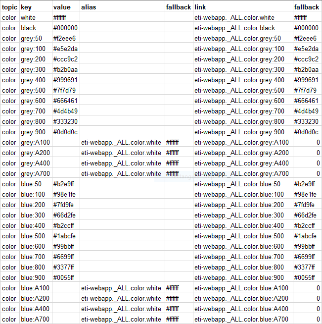

# Color Tokens Documentation

## Color Token Database Snapshot

## Color Tokens Reference Table (Duplicate of Snapshot Above)

Color | 	HUE (Name) | 	Shade | 	HEX |
--- | --- | --- | ---
Primary | 	ftiGrey | 	main (500) | 	7F7D79 |
Primary | 	ftiGrey | 	light | 	- |
Primary | 	ftiGrey | 	dark | 	- |
Primary | 	ftiGrey | 	contrastText | 	- |
Primary | 	ftiGrey | 	50 | 	F2EEE6 |
Primary | 	ftiGrey | 	100 | 	E5E2DA |
Primary | 	ftiGrey | 	200 | 	CCC9C2 |
Primary | 	ftiGrey | 	300 | 	B2B0AA |
Primary | 	ftiGrey | 	400 | 	999691 |
Primary | 	ftiGrey | 	450 | 	8C8A85 |
Primary | 	ftiGrey | 	500 | 	7F7D79 |
Primary | 	ftiGrey | 	550 | 	73716D |
Primary | 	ftiGrey | 	600 | 	666461 |
Primary | 	ftiGrey | 	650 | 	595855 |
Primary | 	ftiGrey | 	700 | 	4D4B49 |
Primary | 	ftiGrey | 	750 | 	403F3D |
Primary | 	ftiGrey | 	800 | 	333230 |
Primary | 	ftiGrey | 	850 | 	262524 |
Primary | 	ftiGrey | 	900 | 	1A1918 |
Primary | 	ftiGrey | 	950 | 	0D0D0C |
Secondary | 	ftiBlue | 	main (500+) | 	1ABCFE |
Secondary | 	ftiBlue | 	light | 	- |
Secondary | 	ftiBlue | 	dark | 	- |
Secondary | 	ftiBlue | 	contrastText | 	- |
Secondary | 	ftiBlue | 	50 | 	B2E9FF |
Secondary | 	ftiBlue | 	100 | 	98E1FE |
Secondary | 	ftiBlue | 	200 | 	7FD9FE |
Secondary | 	ftiBlue | 	300 | 	66D2FE |
Secondary | 	ftiBlue | 	400 | 	B2CCFF |
Secondary | 	ftiBlue | 	500+ | 	1ABCFE |
Secondary | 	ftiBlue | 	600 | 	99BBFF |
Secondary | 	ftiBlue | 	700 | 	6699FF |
Secondary | 	ftiBlue | 	800 | 	3377FF |
Secondary | 	ftiBlue | 	900 | 	0055FF |
Secondary | 	ftiBlue | 	950 | 	002B80 |
Error | 	Error | 	- | 	? |
SurfaceAppUI | 	SurfaceAppUI | 	- | 	191918 |
SurfaceAppBar | 	SurfaceAppBar | 	- | 	262624 |
SurfaceDrawers | 	SurfaceDrawers | 	- | 	0D0D0C |
SurfaceSideSheets | 	SurfaceSideSheets | 	- | 	0D0D0C |
SurfaceCardsBanners | 	SurfaceCardsBanners | 	- | 	161618 |
SurfaceSheets | 	SurfaceSheets | 	- | 	262624 |
SurfaceDialog | 	SurfaceDialog | 	- | 	333230 |
SurfaceMenu | 	SurfaceMenu | 	- | 	0D0D0C |
SurfaceSnackbar | 	SurfaceSnackbar | 	- | 	000000 |
TypeActive | 	TypeActive | 	- | 	E5E2DA |
TypeInactive | 	TypeInactive | 	- | 	666461 |
Positive | 	Positive | 	- | 	068062 |
Negative | 	Negative | 	- | 	BA1C1C |
BuyA11Y | 	BuyA11Y | 	- | 	13BE95 |
SellA11Y | 	SellA11Y | 	- | 	DF4444 |

Reference
[Material.io Reference](https://material.io/design/color/the-color-system.html)
