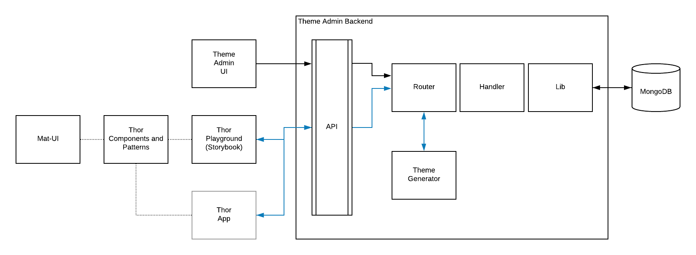
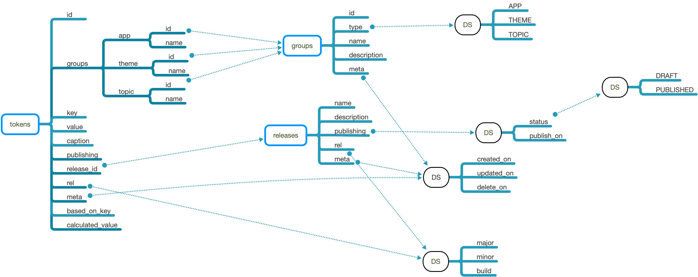
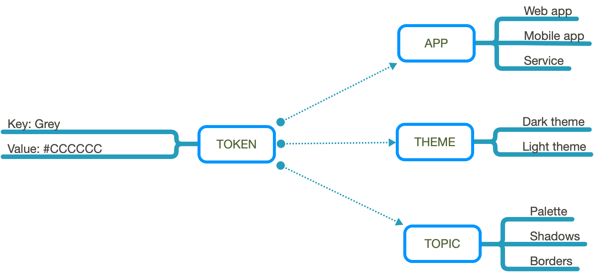
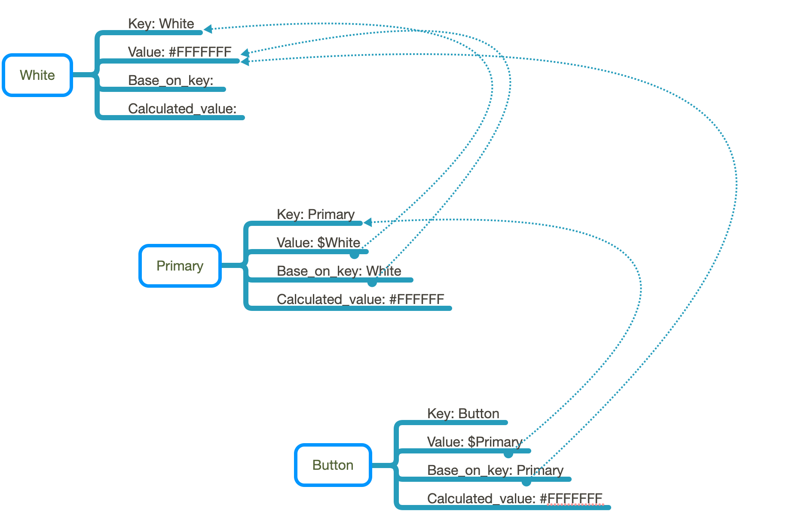

# Overview

The Design System is engineered to provide presentation layer attributes to subscribed apps. The Design System will house indivisible styling pieces of information that comprise the presentation layer. These pieces of styling information are called Design Tokens. Centralizing design tokens allows for design and engineering teams to communicate branding concepts and rules across all subscribed platforms and apps within an organization.

The Design System will have the following architecture:



Design tokens are entered into the Theme Administrator through a UI. This UI will allow a user to create and manage all design tokens. Design tokens can be entered as simple key-value pairs or can be related to each other. This UI will be developed in the future. For now updates to the design tokens will be performed directly through the API.

### Data Model

The design system data model has the following structure:



The data model is broken down into 3 basic structures:

1. Groups
2. Releases
3. Tokens

#### Groups

Groups allows tokens to be gathered into different groups. In the following diagram the token for the color Grey has a value of \#CCCCCC but is also linked to different groups.



These groups are also used in our design token api to group tokens. Those groups are:

1. App: A particular application.
2. Theme: A particular theme.
3. Topic: A grouping of similar tokens.

These groups are hard set within the api coding. Filtering is available for app and theme group combinations from a theme endpoint

So each token requires a existing app, theme and topic UID \(unique ID\) before it can be entered.

#### Releases

Releases are express a major, minor and build number for the design token api. Each token must also be linked to an existing release.

#### Tokens

The tokens are the central piece of the design token api. they are used to express a key/value pair linked to a group and release UID. Basically each token has the following elements:

- Group-App: The group for the app that the token is associated with.
- Group-Theme: The group for the theme that the token is associated with.
- Group-Topic: The group for the topic that the token is associated with.
- Key: The associated key for the token. If a token is based on another token then the token is started with a "\$" in the first character.
- Value: The value associated with the token.

  - Three different representation can be expressed via notation:
    - 1. Subkey related within an object.
      2. Subkey expressed as an array
      3. Standard with no subkey.

  Examples are noted below

- Caption: a caption describing the token
- Publishing: Is an object containing publishing status and the publishing date for the token
- Release id: The associated release id
- Rel: The release object
- Meta: Meta data related to the token
- Base on key: When keys are related to another, this value represents the based on or related key value
- Calculated value: The base value that is associated with the base on key.

Some examples of Value notation:

- Subkey related within an array.

  - Grey:50
  - Grey:100
  - Grey:200

  Would be expressed in the theme as:

```javascript
Grey: [
50: value 1,
100: value 2,
150: value 3
]
```

- Subkey related within an object.

  - Grey\|font
  - Grey\|weight
  - Grey\|line-height

  Would be expressed in the theme as:

```javascript
Grey: {
font: value 1,
weight: value 2,
line-height: value 3
}
```

Some examples of key association and their base on key value and calculated value representation:



In the example above, The "White" token acts as a base. The "Primary" token is related to the "White token and gets its value. It is based on the "White" token and the calculated value is that of the "white" token. If the "White" token changes so does the tokens related to it. So changing the "white" token to another color would result in all related, directly as the "Primary" token is, or indirectly, as the "Button" token is, would change.

The "Button" token inherits its value from the "Primary" token. In this case changes to the "White" token or the "Primary" token would result in a change to the "Button" token. For example, if the "Primary" token value would change to \#CCCCCC, this would "recouple" the "White" and "Primary" token from each other. However, since the "Primary" token and the "Button" token are related, that change would effect the "Button" token as well. The new "Button" token would have the Calculated value be "\#CCCCCC"
